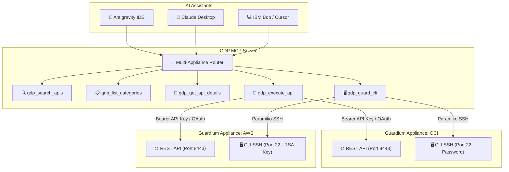

# IBM Guardium Data Protection (GDP) MCP Server

[](https://www.python.org/)
[](LICENSE)
[](tests/)
[](https://modelcontextprotocol.io/)
[](https://github.com/IBM/gdp-mcp-server)

An enhanced **Model Context Protocol (MCP)** server that exposes **IBM Guardium Data Protection (GDP)** REST APIs, GuardAPI functions, and administrative CLI commands to AI assistants.

Enable autonomous AI agents (such as **Antigravity IDE**, **Claude Desktop**, **IBM Bob**, **VS Code Copilot**, or **Cursor**) to inspect database activity, audit compliance (SOX, GDPR, PCI-DSS), manage security policies, query Guardium status, and execute Guardium CLI diagnostics using natural language.

---

> ### 📢 Upstream Fork Notice
> This repository is an enhanced, production-ready fork of the official [IBM/gdp-mcp-server](https://github.com/IBM/gdp-mcp-server) created by IBM.
> 
> While the upstream IBM repository provides the initial FastMCP foundation for a single appliance, this fork addresses critical operational requirements for enterprise multi-cloud environments (AWS EC2, Oracle Cloud Infrastructure, on-premise appliances) and modern Python packaging standards.

---

## 🌟 What's New in this Fork (Key Enhancements)

| Feature | Upstream (`IBM/gdp-mcp-server`) | This Fork (`pcontramaestre/gdp-mcp-server`) |
| :--- | :--- | :--- |
| **Multi-Appliance Architecture** | ❌ Single appliance only (`GDP_HOST`) | ✅ **Multi-Appliance Support** via `GDP_APPLIANCES=oci,aws,...` and dynamic routing parameter `appliance="oci"` in all tools. |
| **Authentication Methods** | ⚠️ OAuth2 client credentials only | ✅ **Direct Encoded API Key** (`GDP_API_KEY` from `grdapi create_api_key`) and OAuth2 credentials with automatic token lifecycle. |
| **CLI over SSH Authentication** | ⚠️ Password-only (`GDP_CLI_PASS`) on non-standard port `2222` | ✅ **RSA Private Key Support** (`GDP_CLI_KEY_FILE`), standard port **22**, plus password fallback. Required for AWS Guardium EC2. |
| **SSH Shell Compatibility** | ⚠️ Fails on Guardium's restricted `cli_wrapper` | ✅ **Interactive PTY Session** (`invoke_shell(width=200, height=50)`) handling banners and prompt termination cleanly. |
| **Packaging & Executable** | ❌ No `pyproject.toml`, raw script execution | ✅ **PEP 621 `pyproject.toml`** and `requirements.txt`. Installs global executable command `gdp-mcp`. |
| **MCP SDK Version Pinning** | ⚠️ Incompatible with MCP 2.x breaking changes | ✅ **Pinned `mcp>=1.2.0,<2`** (FastMCP) ensuring rock-solid stability and zero runtime import crashes. |
| **Automated Test Suite** | ❌ Minimal testing | ✅ **113 automated unit tests** (`pytest tests/`) validating CLI parsing, destructive command filters, and error recovery. |

---

## 🏗️ Architecture



---

## 🚀 Quickstart: Installation from Scratch

### 1. Prerequisites
- **Python:** Version `3.11` or `3.12` (Python 3.12 recommended).
- **Package Manager:** [`uv`](https://docs.astral.sh/uv/) (recommended for ultra-fast setup) or standard `pip` / `venv`.
- **Network Access:**
  - Port `8443` (TCP HTTPS) to Guardium appliances (REST API).
  - Port `22` (TCP SSH) to Guardium appliances (Guardium CLI).

---

### 2. Clone the Repository
```bash
git clone https://github.com/pcontramaestre/gdp-mcp-server.git
cd gdp-mcp-server
```

---

### 3. Create Virtual Environment and Install

#### Option A: Using `uv` (Recommended)
```bash
# 1. Create virtual environment
uv venv

# 2. Activate virtual environment
source .venv/bin/activate

# 3. Install in editable mode with test dependencies
uv pip install -e ".[test]"
```

#### Option B: Using standard `python3` & `pip`
```bash
# 1. Create virtual environment
python3 -m venv .venv

# 2. Activate virtual environment
source .venv/bin/activate

# 3. Upgrade pip and install
pip install --upgrade pip
pip install -e ".[test]"
```

Verify that the `gdp-mcp` executable is available:
```bash
gdp-mcp --help
```

---

### 4. Run the Test Suite
Ensure all 113 unit tests pass before configuring connections:
```bash
pytest tests/
```
Output:
```text
============================= 113 passed in 0.39s ==============================
```

---

## ⚙️ Configuration (`.env`)

Copy the provided template:
```bash
cp .env.example .env
```

Edit `.env` according to your deployment model:

### Mode 1: Single Appliance (Default)
Ideal if you are connecting to a single Central Manager or Collector:

```bash
# MCP Server Transport Mode: stdio (for local IDE) or streamable-http
MCP_TRANSPORT=stdio
MCP_HOST=0.0.0.0
MCP_PORT=8003

# -------------------------------------------------------------
# REST API Configuration (Option A: Direct API Key - Preferred)
# -------------------------------------------------------------
GDP_HOST=192.168.1.50
GDP_PORT=8443
GDP_API_KEY=tu_api_key_codificada_de_guardium
GDP_VERIFY_SSL=false

# -------------------------------------------------------------
# REST API Configuration (Option B: OAuth2 Client Credentials)
# -------------------------------------------------------------
# GDP_USERNAME=admin
# GDP_PASSWORD=tu_password_gui
# GDP_CLIENT_ID=gdp_aim_client
# GDP_CLIENT_SECRET=tu_client_secret_oauth

# -------------------------------------------------------------
# Guardium CLI / SSH Configuration
# -------------------------------------------------------------
GDP_CLI_HOST=192.168.1.50
GDP_CLI_PORT=22
GDP_CLI_USER=cli
GDP_CLI_PASS=tu_password_cli
# For AWS EC2 / Cloud instances requiring RSA key pair:
# GDP_CLI_KEY_FILE=/home/usuario/.ssh/id_rsa_guardium
```

---

### Mode 2: Multi-Appliance (Enterprise & Multi-Cloud)
Manage multiple appliances simultaneously (e.g. OCI Collector, AWS Collector, On-Premise Central Manager).

Set `GDP_APPLIANCES` with comma-separated aliases. The first alias listed serves as the default appliance when no `appliance` argument is specified in tool calls.

```bash
MCP_TRANSPORT=stdio

# Define registered appliances
GDP_APPLIANCES=oci,aws

# -------------------------------------------------------------
# Appliance 1: OCI Collector (Password CLI + API Key)
# -------------------------------------------------------------
GDP_OCI_HOST=192.168.1.100
GDP_OCI_PORT=8443
GDP_OCI_API_KEY=tu_api_key_de_oci
GDP_OCI_VERIFY_SSL=false
GDP_OCI_CLI_HOST=192.168.1.100
GDP_OCI_CLI_PORT=22
GDP_OCI_CLI_USER=cli
GDP_OCI_CLI_PASS=tu_password_cli_oci

# -------------------------------------------------------------
# Appliance 2: AWS Collector (RSA SSH Key + API Key)
# -------------------------------------------------------------
GDP_AWS_HOST=192.168.1.101
GDP_AWS_PORT=8443
GDP_AWS_API_KEY=tu_api_key_de_aws
GDP_AWS_VERIFY_SSL=false
GDP_AWS_CLI_HOST=192.168.1.101
GDP_AWS_CLI_PORT=22
GDP_AWS_CLI_USER=cli
GDP_AWS_CLI_KEY_FILE=/home/usuario/.ssh/id_rsa_guardium
```

> 🔒 **Security Note:** Never commit your `.env` file or private SSH keys to Git. The `.gitignore` is pre-configured to strictly ignore `.env`, `.pem`, `.key`, and credential stores.

---

## 🔑 Generating Guardium Credentials

### 1. Generating an Encoded API Key
Log in to the Guardium CLI on your Central Manager or Collector via SSH:
```bash
ssh cli@<guardium-host>
```
Run the following GuardAPI command:
```bash
grdapi create_api_key name=gdp_mcp
```
Copy the **Encoded API key** string from the output and assign it to `GDP_API_KEY` (or `GDP_<NAME>_API_KEY`).

### 2. Setting Up AWS EC2 RSA SSH Key
Guardium appliances deployed in AWS EC2 disallow password authentication by default. To configure CLI access:
1. Ensure your RSA private key is saved with restricted permissions:
   ```bash
   chmod 600 ~/.ssh/id_rsa_guardium
   ```
2. Reference the absolute path in your `.env`:
   ```bash
   GDP_AWS_CLI_KEY_FILE=/home/usuario/.ssh/id_rsa_guardium
   ```

---

## 🔌 Connecting to AI Assistants & IDEs

### 1. Antigravity IDE
Add the server configuration to `~/.gemini/config/mcp_config.json`:
```json
{
  "mcpServers": {
    "gdp-mcp": {
      "command": "/home/usuario/Desarrollo/gdp-mcp-server/.venv/bin/gdp-mcp",
      "args": ["--transport", "stdio"],
      "cwd": "/home/usuario/Desarrollo/gdp-mcp-server",
      "disabled": false
    }
  }
}
```

### 2. Claude Desktop
Add to your Claude Desktop configuration (`~/.config/Claude/claude_desktop_config.json` on Linux, or `~/Library/Application Support/Claude/claude_desktop_config.json` on macOS):
```json
{
  "mcpServers": {
    "guardium": {
      "command": "/home/usuario/Desarrollo/gdp-mcp-server/.venv/bin/gdp-mcp",
      "args": ["--transport", "stdio"],
      "cwd": "/home/usuario/Desarrollo/gdp-mcp-server"
    }
  }
}
```

### 3. Cursor / VS Code Copilot
Configure an MCP stdio server with:
- **Command:** `<path-to-repo>/.venv/bin/gdp-mcp`
- **Args:** `["--transport", "stdio"]`
- **Cwd:** `<path-to-repo>`

---

## 🌐 HTTP mode (streamable-http / SSE)

The recommended setup is `stdio` (a local process started by your MCP client). The server can also run as a network service with `--transport streamable-http`; in that mode `/mcp` and `/sse` require an API key, and `/admin` requires `MCP_ADMIN_TOKEN`.

By default it listens on `0.0.0.0`; set `MCP_HOST=127.0.0.1` unless you really want it reachable from the network, and put a TLS reverse proxy in front if you expose it.

Create an API key with:

```bash
curl -X POST http://127.0.0.1:8003/admin/keys \
  -H "Authorization: Bearer $MCP_ADMIN_TOKEN" \
  -H "Content-Type: application/json" -d '{"user": "my-client"}'
```

Clients then send `Authorization: Bearer <api_key>`.

`GET /health` is public and only returns `{"status": "ok"}`. Configured appliances and key counts are available at `GET /admin/health` with the admin token. The key store defaults to `/data/keys.json`; set `GDP_MCP_KEY_STORE_PATH` to a writable path for a local install.

## 🛠️ Available MCP Tools

| Tool | Description | Key Parameters |
| :--- | :--- | :--- |
| `gdp_search_apis` | Search available GuardAPI / REST endpoints by keyword or tag. | `query` (str), `category` (optional), `appliance` (optional) |
| `gdp_list_categories` | List all functional API categories indexed on the appliance. | `appliance` (optional) |
| `gdp_get_api_details` | Retrieve complete parameter schema, HTTP method, and path for an API. | `api_name` (str), `appliance` (optional) |
| `gdp_execute_api` | Execute a GuardAPI function or REST endpoint with JSON parameters. | `api_name` (str), `parameters` (dict), `appliance` (optional) |
| `gdp_guard_cli` | Run Guardium administrative CLI commands via authenticated SSH session. | `command` (str), `appliance` (optional) |
| `gdp_list_appliances` | List configured appliances with identity (hostname, IP, unit type, version) and REST/CLI reachability and latency (JSON). | none |
| `gdp_get_system_metrics` | Structured health metrics via REST (CPU, memory, `/` and `/var` disk, uptime, sniffer buffer/queues, MySQL) with warnings and optional trend. | `appliance` (optional), `samples` (1-60), `include_raw` |

### ⚡ Persistent CLI session

Each appliance keeps one SSH session to the Guard CLI and reuses it, so the first `gdp_guard_cli` call pays the ~9 s login/banner and the following ones take ~0.3 s. Commands on the same appliance run one at a time; different appliances are independent.

- The Guard CLI closes sessions that stay idle for about 4 minutes, so a session is recycled after `GDP_CLI_IDLE_TTL` seconds without use (default `180`, capped at `210`). The next call after that opens a fresh one.
- If the session turns out to be dead before a command is sent, it is replaced and the command is retried once. A command that was already sent is never re-sent.
- If a command times out, the session is discarded so its leftover output cannot leak into the next command.
- Set `GDP_CLI_PERSISTENT=false` to go back to one SSH connection per command. Both settings also accept the per-appliance prefix (e.g. `GDP_OCI_CLI_IDLE_TTL`).

### 🛡️ CLI Command Safeguards
`gdp_guard_cli` includes a built-in safety inspection engine:
- **Destructive Command Blocking:** Dangerous commands (`store system format`, `restart system`, `halt`, `stop system`) are blocked from accidental autonomous execution.
- **Interactive Prompts Detection:** Commands requesting interactive confirmation `[y/N]` are sanitized to prevent thread hangings.

---

## 💡 Example AI Prompts

Once configured, you can talk to your AI assistant naturally:

- **Diagnostics:**
  > *"Check the system hostname and build version on our AWS Guardium collector."*
  *(The agent calls `gdp_guard_cli(command="show build", appliance="aws")`)*

- **S-TAP Verification:**
  > *"List all active S-TAP agents and inspection engines connected to the OCI collector."*
  *(The agent calls `gdp_execute_api(api_name="list_stap", appliance="oci")`)*

- **API Discovery:**
  > *"Find all GuardAPI endpoints related to managing data source definitions."*
  *(The agent calls `gdp_search_apis(query="datasource")`)*

- **Policy Violations:**
  > *"Check recent policy violations and security alerts from the last 24 hours on all collectors."*

---

## 🧪 Validating via JSON-RPC Stdio Handshake

You can test that the server starts and answers MCP initialization without opening an AI assistant:

```bash
echo '{"jsonrpc": "2.0", "method": "initialize", "params": {"protocolVersion": "2024-11-05", "capabilities": {}, "clientInfo": {"name": "test-client", "version": "1.0"}}, "id": 1}' | .venv/bin/gdp-mcp
```

Expected JSON response:
```json
{
  "jsonrpc": "2.0",
  "id": 1,
  "result": {
    "protocolVersion": "2024-11-05",
    "capabilities": {"tools": {"listChanged": false}, "prompts": {"listChanged": false}, "resources": {"subscribe": false, "listChanged": false}},
    "serverInfo": {"name": "gdp-mcp", "version": "2.0.0"}
  }
}
```

---

## 👥 Credits & Upstream Attribution

- **Original Project & Base Architecture:** [IBM/gdp-mcp-server](https://github.com/IBM/gdp-mcp-server) by **Anuj Shrivastava** (`ashrivastava@in.ibm.com`), AI Engineer, IBM US Industry Market.
- **Enhanced Multi-Appliance & Cloud Fork:** **Pablo Contramaestre** ([@pcontramaestre](https://github.com/pcontramaestre)).

---

## 📄 License & Disclaimers

This project is licensed under the **Apache License 2.0** — see the [LICENSE](LICENSE) file for details.

> **Disclaimer:** This tool interacts directly with IBM Guardium Data Protection appliances. Always test API calls and CLI scripts in non-production environments before executing administrative commands on production security infrastructure.
