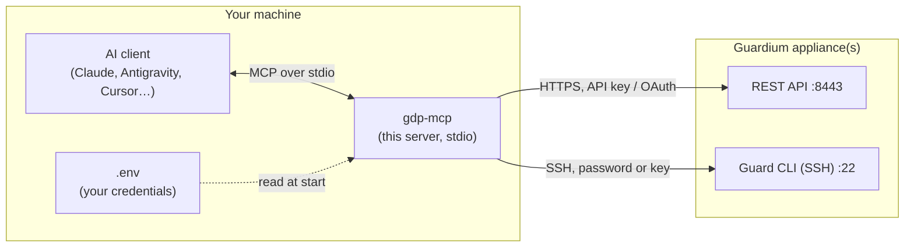

# IBM Guardium Data Protection (GDP) MCP Server

[](https://github.com/pcontramaestre/gdp-mcp-server/actions/workflows/ci.yml)
[](https://www.python.org/)
[](https://github.com/IBM/gdp-mcp-server)

A **Model Context Protocol (MCP)** server that lets an AI assistant work with your **IBM Guardium Data Protection (GDP)** appliances: query the REST API and GuardAPI functions, run Guard CLI commands over SSH, and read health metrics, all in natural language.

It runs **on your own machine**, started by your AI client (Claude, Antigravity, Cursor, VS Code…), and talks to your collectors/aggregators/central manager with **your** credentials. Nothing is hosted anywhere and no port is opened in the default mode.

> **Fork notice.** This is an extended fork of [IBM/gdp-mcp-server](https://github.com/IBM/gdp-mcp-server). See [What this fork adds](#what-this-fork-adds).

---

## Contents

- [What you can do with it](#what-you-can-do-with-it)
- [How it works](#how-it-works)
- [Install](#install)
- [Configure your appliances (`.env`)](#configure-your-appliances-env)
- [Connect your AI assistant](#connect-your-ai-assistant)
- [Tools, prompts and resources](#tools-prompts-and-resources)
- [Using it](#using-it)
- [Security: read this before installing](#security-read-this-before-installing)
- [Configuration reference](#configuration-reference)
- [Guard CLI details](#guard-cli-details)
- [HTTP mode (advanced, optional)](#http-mode-advanced-optional)
- [Troubleshooting](#troubleshooting)
- [Development](#development)
- [What this fork adds](#what-this-fork-adds)
- [Credits and license](#credits-and-license)

---

## What you can do with it

Ask your assistant things like:

- *"Which Guardium appliances do I have configured, and are they online?"*
- *"Show CPU, memory, disk and sniffer buffer health of the OCI collector."*
- *"What is the hostname, build and unit type of the AWS collector?"* (runs `show build`, `show unit type`…)
- *"List the S-TAPs reporting to the OCI collector."*
- *"Find the GuardAPI functions to manage datasources and show me their parameters."*
- *"Create the security assessment report for the AWS collector."* (built-in report prompts)

Several appliances can be configured at once (for example an OCI collector, an AWS collector and an on-premise central manager); every tool takes an optional `appliance` argument to pick one.

## How it works



Your AI client launches `gdp-mcp` as a child process and speaks MCP to it over stdin/stdout. The server reads the appliance addresses and credentials from `.env`, discovers the available REST/GuardAPI endpoints once (and caches them), and exposes everything as MCP tools.

---

## Install

### Requirements

- **Python 3.11 or 3.12**
- Network access from your machine to each appliance: **TCP 8443** (REST API) and, if you want the CLI tool, **TCP 22** (SSH).
- A Guardium account or API key for the REST API, and a CLI user for SSH (see [Getting credentials](#getting-credentials)).
- Linux or macOS. Windows should work (use `.venv\Scripts\gdp-mcp.exe` where the examples say `.venv/bin/gdp-mcp`) but it is not tested.

### Steps

```bash
git clone https://github.com/pcontramaestre/gdp-mcp-server.git
cd gdp-mcp-server

python3 -m venv .venv            # or: uv venv
source .venv/bin/activate
pip install -e .                 # or: uv pip install -e .

gdp-mcp --help                   # check that the command exists
```

> **Install it from the clone (`pip install -e .`).** The server reads its `.env` from the folder of the clone, so do not move the folder after installing and do not install it as a regular package into site-packages.

---

## Configure your appliances (`.env`)

```bash
cp .env.example .env
chmod 600 .env        # only you should be able to read it
```

Edit `.env`. **This file is the only place where the server reads credentials from**; it is ignored by git. Never put passwords or keys in your AI client's configuration file or in chat.

### One appliance

```bash
GDP_HOST=192.168.1.50
GDP_PORT=8443

# REST authentication: either an encoded API key (preferred)…
GDP_API_KEY=your_encoded_api_key
# …or OAuth2 with a registered client:
# GDP_USERNAME=admin
# GDP_PASSWORD=your_gui_password
# GDP_CLIENT_ID=gdp_aim_client
# GDP_CLIENT_SECRET=your_client_secret

# Guard CLI over SSH (optional, only for gdp_guard_cli)
GDP_CLI_USER=cli
GDP_CLI_PASS=your_cli_password
# GDP_CLI_KEY_FILE=/home/you/.ssh/id_rsa_guardium    # key instead of password
```

If `GDP_API_KEY` is set it is used; otherwise the OAuth2 variables are used.

### Several appliances

List the names in `GDP_APPLIANCES`; the first one is the default. Each name gets its own prefixed variables, and any variable you leave out falls back to the unprefixed `GDP_*` one.

```bash
GDP_APPLIANCES=oci,aws

GDP_OCI_HOST=192.168.1.100
GDP_OCI_API_KEY=key_for_oci
GDP_OCI_CLI_USER=cli
GDP_OCI_CLI_PASS=password_for_oci

GDP_AWS_HOST=192.168.1.101
GDP_AWS_API_KEY=key_for_aws
GDP_AWS_CLI_USER=cli
GDP_AWS_CLI_KEY_FILE=/home/you/.ssh/id_rsa_guardium   # AWS appliances usually need a key
```

### Getting credentials

**Encoded API key.** SSH to the appliance's CLI and run:

```text
grdapi create_api_key name=gdp_mcp
```

Copy the *Encoded API key* from the output into `GDP_API_KEY`. Prefer an API key (or account) created **just for this tool** with the minimum roles you need; see [Security](#security-read-this-before-installing).

**SSH key (cloud appliances).** If the appliance rejects passwords, point `GDP_CLI_KEY_FILE` at your private key (`chmod 600` it).

### Check that it works

Without any AI client, you can confirm that the server starts and answers the MCP handshake:

```bash
echo '{"jsonrpc":"2.0","method":"initialize","params":{"protocolVersion":"2024-11-05","capabilities":{},"clientInfo":{"name":"test","version":"1"}},"id":1}' | .venv/bin/gdp-mcp --transport stdio
```

You should get a JSON response with `serverInfo`. After connecting a client (next section), the first thing to ask is *"list my Guardium appliances"*: it calls `gdp_list_appliances` and shows whether each REST API and CLI is reachable.

---

## Connect your AI assistant

In every case the client has to start this command:

```text
/absolute/path/to/gdp-mcp-server/.venv/bin/gdp-mcp --transport stdio
```

Use the **absolute path** of your clone. You do **not** need to set a working directory or pass credentials: the server finds `.env` by itself. Restart the client after changing its MCP configuration.

### Claude Code

```bash
claude mcp add gdp-mcp --scope user -- /absolute/path/to/gdp-mcp-server/.venv/bin/gdp-mcp --transport stdio
claude mcp list          # gdp-mcp should show as Connected
```

`--scope user` makes it available in every project; use `--scope project` to share it through a `.mcp.json` file in a repository (it only contains the command, never credentials).

### Claude Desktop

Edit the configuration file (**Settings → Developer → Edit Config**; on Linux `~/.config/Claude/claude_desktop_config.json`, on macOS `~/Library/Application Support/Claude/claude_desktop_config.json`):

```json
{
  "mcpServers": {
    "guardium": {
      "command": "/absolute/path/to/gdp-mcp-server/.venv/bin/gdp-mcp",
      "args": ["--transport", "stdio"]
    }
  }
}
```

### Antigravity

Open the MCP servers panel of Antigravity and choose **Manage MCP Servers → View raw config** (menu names may vary by version); that opens its `mcp_config.json`. Add:

```json
{
  "mcpServers": {
    "gdp-mcp": {
      "command": "/absolute/path/to/gdp-mcp-server/.venv/bin/gdp-mcp",
      "args": ["--transport", "stdio"],
      "disabled": false
    }
  }
}
```

The file lives under `~/.gemini/` and its exact location depends on the Antigravity version (for example `~/.gemini/antigravity/mcp_config.json` or `~/.gemini/config/mcp_config.json`), so use the panel to find the one your installation reads. If Antigravity does not ask for confirmation before running the tools, see [Security](#security-read-this-before-installing).

### Cursor

Add the server to `~/.cursor/mcp.json` (global) or `.cursor/mcp.json` (per project):

```json
{
  "mcpServers": {
    "gdp-mcp": {
      "command": "/absolute/path/to/gdp-mcp-server/.venv/bin/gdp-mcp",
      "args": ["--transport", "stdio"]
    }
  }
}
```

### VS Code (GitHub Copilot)

Create `.vscode/mcp.json` in your workspace (or use **MCP: Add Server** from the command palette):

```json
{
  "servers": {
    "gdp-mcp": {
      "type": "stdio",
      "command": "/absolute/path/to/gdp-mcp-server/.venv/bin/gdp-mcp",
      "args": ["--transport", "stdio"]
    }
  }
}
```

### Any other MCP client

Anything that can launch a stdio MCP server works: give it the command and arguments above. Clients that only speak HTTP/SSE can use the [HTTP mode](#http-mode-advanced-optional).

---

## Tools, prompts and resources

### Tools

| Tool | What it does | Arguments |
| :--- | :--- | :--- |
| `gdp_list_appliances` | Lists the configured appliances with identity (hostname, IP, unit type, version), and REST/CLI reachability and latency. Start here. | none |
| `gdp_get_system_metrics` | Health metrics as JSON: CPU, memory, `/` and `/var` disk, uptime, sniffer buffer/queues/drops, MySQL, with `status`, `warnings` and optional trend. | `appliance`, `samples` (1-60), `include_raw` |
| `gdp_list_categories` | API categories discovered on the appliance. | `appliance` |
| `gdp_search_apis` | Searches REST/GuardAPI endpoints by keyword, category or HTTP verb. | `query`, `category`, `verb`, `appliance` |
| `gdp_get_api_details` | Full parameter schema of one endpoint. | `api_function_name`, `appliance` |
| `gdp_execute_api` | Runs a REST/GuardAPI endpoint. Reads run directly; calls that change something ask for confirmation. | `api_function_name`, `parameters`, `appliance` |
| `gdp_guard_cli` | Runs a Guard CLI command over SSH. Read-only commands run directly; anything else asks for confirmation. | `command`, `appliance` |

The usual flow for the API is `gdp_search_apis` → `gdp_get_api_details` → `gdp_execute_api`.

### Prompts (report templates)

`security_assessment_report`, `compliance_summary_report`, `datasource_inventory_report`, `activity_monitoring_report`, `system_health_report`, `vulnerability_assessment_report`, `stap_status_report`, `policy_violations_report`. They guide the assistant through the right calls and produce a structured report.

### Resources

`gdp://appliances`, `gdp://categories`, `gdp://endpoints/{name}`, `gdp://cli/reference` (about 600 Guard CLI commands) and `gdp://server/info`.

---

## Using it

A typical session:

1. *"List my Guardium appliances."* → `gdp_list_appliances`
2. *"How is the AWS collector doing?"* → `gdp_get_system_metrics(appliance="aws")`
3. *"Which API shows S-TAP status?"* → `gdp_search_apis(query="stap")`, then `gdp_get_api_details`
4. *"Run it on OCI."* → `gdp_execute_api(api_function_name="list_stap", appliance="oci")`
5. *"What version is the OCI collector?"* → `gdp_guard_cli(command="show build", appliance="oci")`

The first call that needs the endpoint index builds it from the appliance (it can take from a few seconds up to a minute or two) and caches it in `gdp_discovery_<appliance>.json` in the clone; later calls are instant. Set `GDP_CACHE_DIR` to keep the cache elsewhere.

---

## Security: read this before installing

This tool gives an AI assistant the same access to your Guardium appliances that the configured account has. It is meant for **local, per-user installs**: each person installs their own copy with their own credentials. There is no shared server and no user management.

**What the assistant can and cannot do**

| Action | Behavior |
| :--- | :--- |
| Read data (`GET`, `list_*`/`get_*`, online reports, `show …`, `list …`, `support show …`, `grdapi list_*`/`get_*`) | Runs directly. |
| Anything else (create/update/delete, restart, `store …`, `set …`, unknown commands, `grdapi create_*`/`delete_*`…) | The client must show a confirmation prompt to **you** before it runs (MCP elicitation). For REST calls the prompt shows the call and its parameter *names* (not values); for CLI commands it shows the full command. |
| Your client does not support confirmation prompts | The call is **blocked**, never run silently. |
| Commands that need interactive input (`diag`, password prompts, wizards…) | Refused; run them yourself over SSH. |

Commands with line breaks or shell operators (`;`, `|`, `&`, `$`, `<`, `>`) are always treated as not read-only.

**What you should do**

- **Use a dedicated, least-privileged account.** Create the API key (or a CLI/GUI user) just for this tool and give it only the roles you need. If you only need to read, give it read-only roles: that is the one control the server cannot bypass.
- **Keep secrets in `.env` only**, with `chmod 600`. Do not paste them in chat or in the client's config file, and do not commit them (`.env` is git-ignored).
- **Do not set the tools to "always allow"/auto-approve** in your client, at least `gdp_execute_api` and `gdp_guard_cli`. Data coming back from the appliance (SQL text, object names, descriptions…) is untrusted input for the model, and the confirmation prompt is your protection against it being manipulated into running something.
- **Test changes on a non-production appliance first.** Always read what a confirmation prompt asks before accepting it.
- **Turn on TLS verification when you can.** `GDP_VERIFY_SSL=false` (the default, because appliances usually have self-signed certificates) skips the certificate check of the REST API, so someone on your network path could intercept the key or password. Install a trusted certificate on the appliance (or add its CA to your system) and set `GDP_VERIFY_SSL=true`.

**What the server already does**

- **No network port in stdio mode.** The server only talks to the AI client through its own pipes.
- **SSH host keys are verified.** The first connection to an appliance records its key in `~/.gdp-mcp/known_hosts` (`GDP_CLI_HOST_KEY_CHECK=tofu`); if the key later changes the connection is refused with an explanation. Use `strict` to only accept hosts you added by hand.
- **Logs go to stderr and avoid secrets.** Arguments of commands that are not read-only and the values of REST parameters are not logged, and HTTP request URLs are kept out of the log. Still, treat `LOG_LEVEL=DEBUG` output as sensitive.
- **REST resource names are validated** (no path traversal or injected URLs).
- **Dependencies were audited** with `pip-audit` (no known vulnerabilities at the time of writing); re-run it periodically.

**Not covered**

- Whoever can run commands as your user, or read your `.env`, has your Guardium access: protect your workstation account.
- The server cannot tell whether the AI is acting on your intent; the confirmation prompts and the account's own permissions are what limit it.

---

## Configuration reference

All settings are read from `.env` (or from real environment variables, which take precedence). For appliances declared in `GDP_APPLIANCES`, every `GDP_*` connection variable can be prefixed with the appliance name, e.g. `GDP_OCI_CLI_PASS`.

| Variable | Default | Meaning |
| :--- | :--- | :--- |
| `GDP_APPLIANCES` | *(empty)* | Comma-separated appliance names for multi-appliance mode; the first is the default. |
| `GDP_HOST`, `GDP_PORT` | `localhost`, `8443` | REST API address. `GDP_EXTERNAL_HOST`/`GDP_EXTERNAL_PORT` take precedence (tunnels, NAT). |
| `GDP_API_KEY` | | Encoded API key (preferred REST authentication). |
| `GDP_USERNAME`, `GDP_PASSWORD`, `GDP_CLIENT_ID`, `GDP_CLIENT_SECRET` | | OAuth2 password grant, used when no API key is set. |
| `GDP_VERIFY_SSL` | `false` | Validate the appliance's TLS certificate (see [Security](#security-read-this-before-installing)). |
| `GDP_REQUEST_TIMEOUT` | `60` | REST request timeout in seconds. |
| `GDP_CLI_HOST`, `GDP_CLI_PORT` | REST host, `22` | Guard CLI SSH address. |
| `GDP_CLI_USER` | `cli` | Guard CLI user. |
| `GDP_CLI_PASS` / `GDP_CLI_KEY_FILE` | | Password or private key for SSH (one of them enables `gdp_guard_cli`). |
| `GDP_CLI_PERSISTENT` | `true` | Reuse one SSH session per appliance. |
| `GDP_CLI_IDLE_TTL` | `180` | Seconds of inactivity before the session is recycled (effective maximum 210). |
| `GDP_CLI_HOST_KEY_CHECK` | `tofu` | `tofu`, `strict` or `off`. |
| `GDP_CLI_KNOWN_HOSTS` | `~/.gdp-mcp/known_hosts` | Where SSH host keys are remembered. |
| `GDP_CACHE_DIR` | the clone | Directory for the endpoint discovery cache. |
| `LOG_LEVEL` | `INFO` | Logging level (logs go to stderr). |
| `MCP_TRANSPORT`, `MCP_HOST`, `MCP_PORT` | `stdio`, `127.0.0.1`, `8003` | Transport and, for HTTP mode, bind address. |
| `MCP_ADMIN_TOKEN` | *(unset)* | HTTP mode only: enables `/admin` ([details](#http-mode-advanced-optional)). |
| `MCP_SSL_CERTFILE`, `MCP_SSL_KEYFILE` | | HTTP mode only: TLS certificate and key. |
| `GDP_MCP_KEY_STORE_PATH` | `~/.gdp-mcp/keys.json` | HTTP mode only: where API keys are stored (hashed). |

---

## Guard CLI details

Each appliance keeps **one SSH session** to the Guard CLI and reuses it: the first `gdp_guard_cli` call pays the ~9 s login and banner, the following ones take well under a second. Commands on the same appliance run one at a time; different appliances are independent.

- The Guard CLI closes sessions that stay idle for about 4 minutes, so a session is recycled after `GDP_CLI_IDLE_TTL` seconds without use.
- If the session turns out to be dead before a command is sent, it is replaced and the command is retried once. A command that was already sent is never sent again.
- If a command times out, the session is discarded so leftover output cannot leak into the next command.
- `GDP_CLI_PERSISTENT=false` goes back to one SSH connection per command.

## HTTP mode (advanced, optional)

`stdio` is the recommended and default mode. The server can also run as a network service for clients that cannot launch a local process:

```bash
gdp-mcp --transport streamable-http --port 8003
```

- `/mcp` (streamable HTTP) and `/sse` (legacy SSE) **require an API key** sent as `Authorization: Bearer <key>`.
- It listens on `127.0.0.1` only. To expose it to other machines set `MCP_HOST` **and** enable TLS (`MCP_SSL_CERTFILE`/`MCP_SSL_KEYFILE`) or put a TLS reverse proxy in front; without TLS the keys travel in clear text and the server logs a warning.
- API keys are created with the admin endpoint, which only works when `MCP_ADMIN_TOKEN` is set in `.env` (use a long random value, e.g. `openssl rand -hex 32`; `/admin` has no rate limiting):

  ```bash
  curl -X POST http://127.0.0.1:8003/admin/keys \
    -H "Authorization: Bearer $MCP_ADMIN_TOKEN" \
    -H "Content-Type: application/json" -d '{"user": "my-client"}'
  ```

  The key is shown once and stored only as a hash in `~/.gdp-mcp/keys.json`. `GET /admin/keys` lists keys and `DELETE /admin/keys/{prefix}` revokes one.
- `GET /health` is public and returns only `{"status": "ok"}`. Appliance list and key count are at `GET /admin/health` (admin token).

Remember that everyone holding an API key reaches the appliances with the **configured account**, so this mode is for a small trusted group, not for exposing Guardium widely.

---

## Troubleshooting

| Symptom | What to check |
| :--- | :--- |
| The tools do not appear in the client | Restart the client after editing its config. Use the **absolute** path to `.venv/bin/gdp-mcp`. Run the handshake command from [Check that it works](#check-that-it-works) to see if the server starts. |
| `Guard CLI is not configured…` | Set `GDP_CLI_PASS` or `GDP_CLI_KEY_FILE` (with the appliance prefix in multi-appliance mode). |
| `SSH host key … does NOT match…` | The appliance's key changed. If it was rebuilt on purpose, delete its line from `~/.gdp-mcp/known_hosts` and retry; if not, investigate before connecting. |
| `SSH authentication failed` | Check `GDP_CLI_USER`, `GDP_CLI_PASS`/`GDP_CLI_KEY_FILE` and the key file permissions (`chmod 600`). |
| REST calls fail with 401/403 | The API key or OAuth credentials are wrong, expired or lack the needed roles. `gdp_list_appliances` shows whether authentication works. |
| `BLOCKED: … does not support elicitation` | Your client cannot show confirmation prompts, so changes are refused. Run that command yourself, or use a client that supports MCP elicitation. |
| The first call is slow | The first call builds the endpoint index and the first CLI command opens the SSH session; later calls are fast. |
| Settings in `.env` are ignored | The server reads `.env` from the folder of the clone. Real environment variables win over `.env`. |
| `Key store unavailable` (HTTP mode) | `~/.gdp-mcp/keys.json` is unreadable or corrupt. Fix or remove it; the server never overwrites a file it cannot read. |

## Development

```bash
pip install -e ".[dev]"
pytest          # unit tests, no appliance needed
ruff check .
```

The repository has a GitHub Actions workflow (`.github/workflows/ci.yml`) that runs `ruff` and `pytest` on Python 3.11 and 3.12.

## What this fork adds

Compared with the original [IBM/gdp-mcp-server](https://github.com/IBM/gdp-mcp-server):

- **Multi-appliance** support (`GDP_APPLIANCES`) with an `appliance` argument on every tool.
- **API key authentication** (`GDP_API_KEY`) besides OAuth2, with automatic token refresh and a persistent HTTP connection.
- **Guard CLI over SSH**: key-based login (`GDP_CLI_KEY_FILE`), standard port 22, an interactive PTY that works with Guardium's restricted `cli_wrapper`, a persistent session, and SSH host-key verification.
- **Safety gates** for state-changing CLI and REST calls (read-only allowlist plus confirmation).
- **New tools**: `gdp_list_appliances` and `gdp_get_system_metrics`.
- **Packaging**: `pyproject.toml`, the `gdp-mcp` command, `mcp` pinned to `<2`, automated tests and CI.

## Credits and license

- **Original project:** [IBM/gdp-mcp-server](https://github.com/IBM/gdp-mcp-server) by **Anuj Shrivastava** (IBM).
- **This fork:** **Pablo Contramaestre** ([@pcontramaestre](https://github.com/pcontramaestre)).

This project is distributed under the **Apache License 2.0**; see the [LICENSE](LICENSE) file.

> **Disclaimer.** This tool acts directly on IBM Guardium Data Protection appliances. Test API calls and CLI commands on non-production systems before using them on production security infrastructure. It is not an official IBM product.
